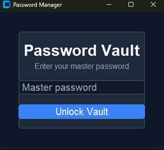
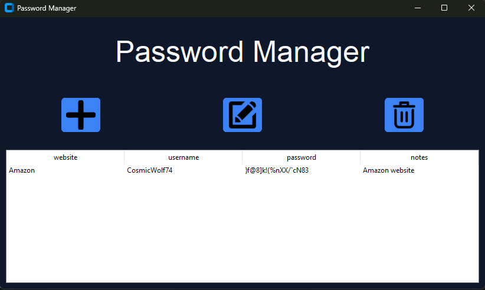
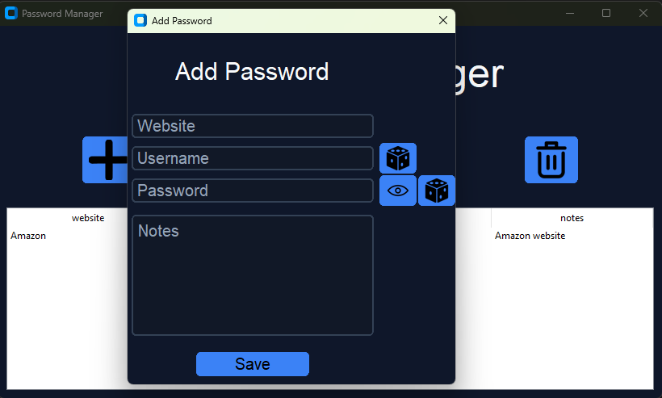

# Password Manager

A desktop password manager built with Python and CustomTkinter.

This application allows users to securely store, manage, and edit account credentials through a clean and simple GUI.

---

## Features

- Master password login system
- Add new accounts
- Edit existing accounts
- Delete accounts
- Encrypted password storage using Fernet (cryptography)
- Random username and password generator
- Show / hide password functionality
- Clean table view with hidden internal IDs

---

## Tech Stack

- Python
- CustomTkinter
- Tkinter (Treeview)
- JSON (local storage)
- Cryptography (Fernet encryption)

---

## Screenshots

### Login Screen


### Main Application


### Add Account Window


---

## How to Run

1. Clone the repository:
```bash
git clone https://github.com/your-username/password_manager.git
cd password_manager
```

2. Install dependencies:
```bash
pip install customtkinter cryptography pillow
```

3. Run the application:
```bash
python main.py
```

